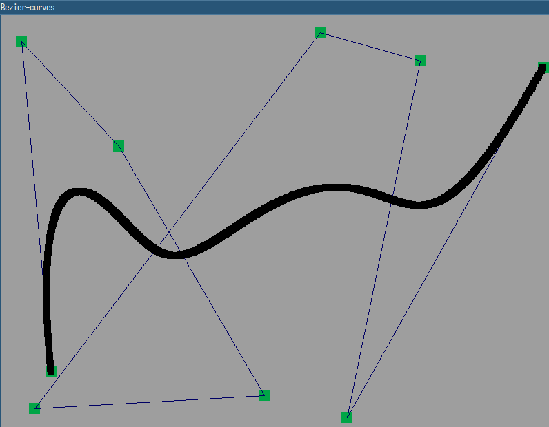
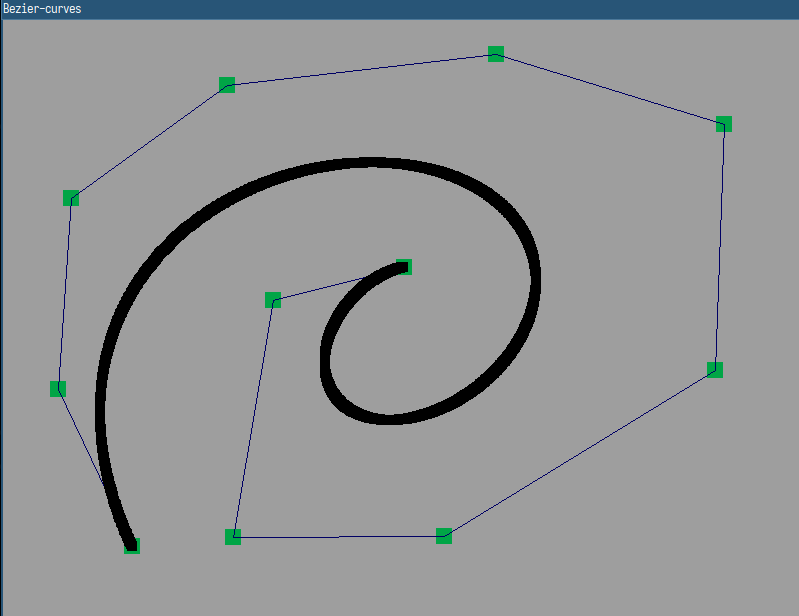

# bezier_curves
program to draw bezier curves

# build on linux
make sure to install SDL2 according to your distro
- make
- ./out
- make clean to clean build

# controls
- mid mouse button = add control point
- right mouse button = undo last control point
- a = change draw mode (line/square)
- d = toggle lines between control points
- move control points with left mouse button

# example/preview

